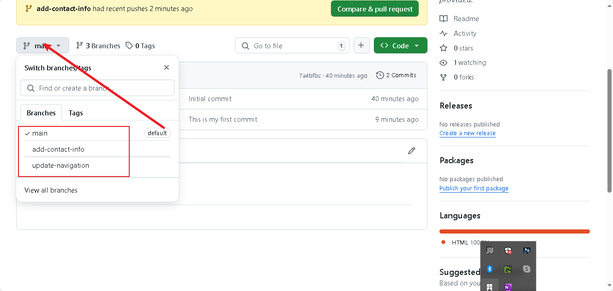
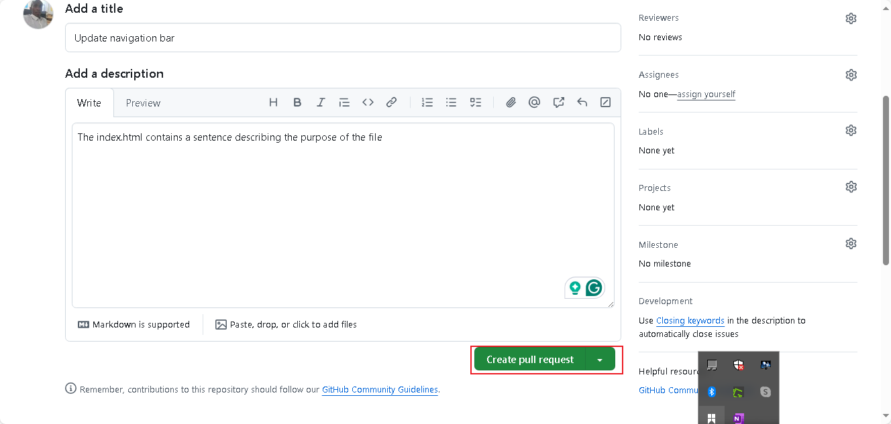
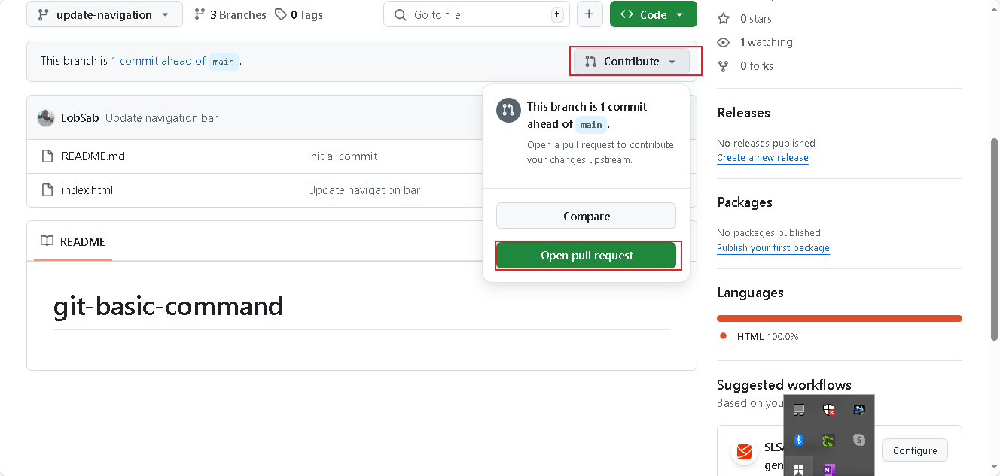
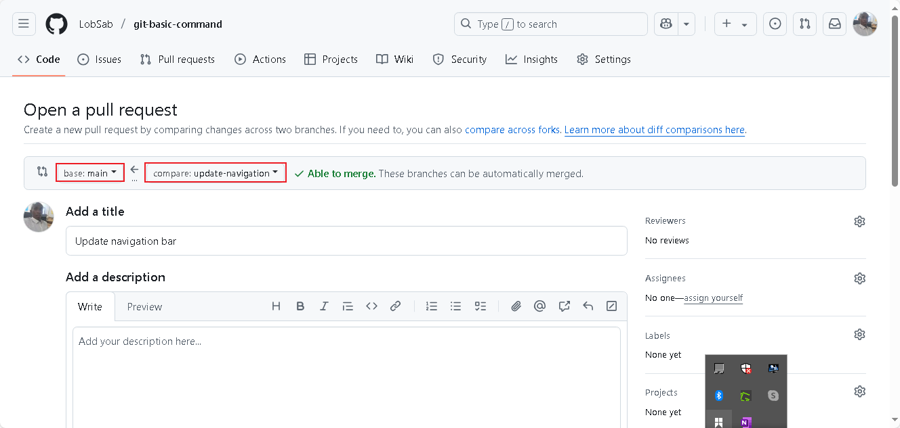
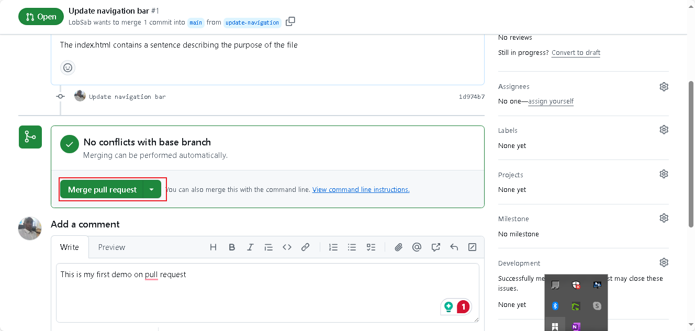
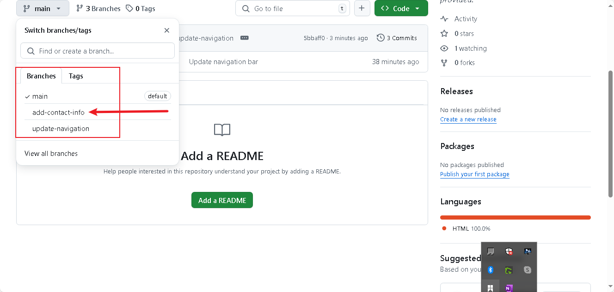
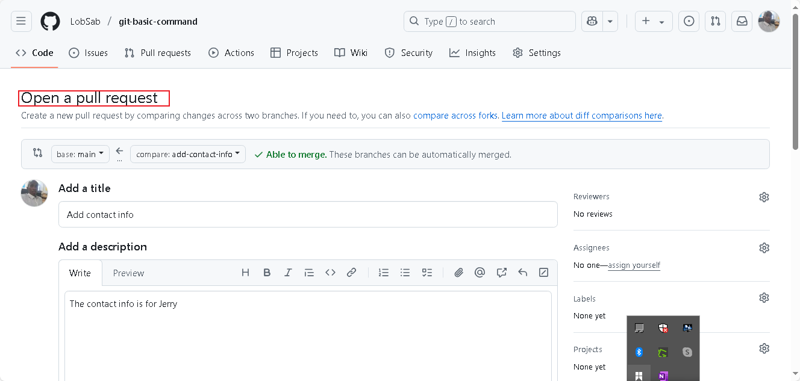
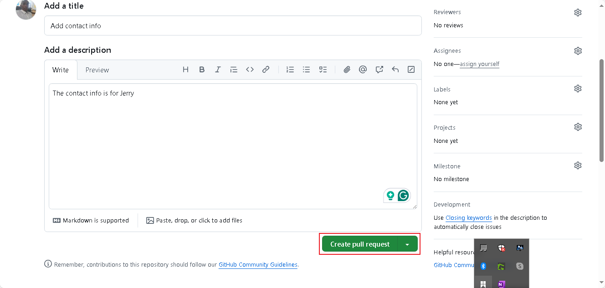
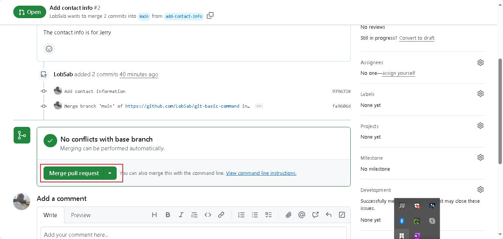
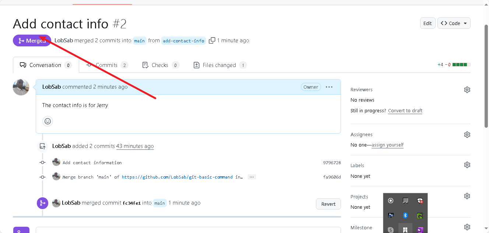

# git-basic-command
### Switch to branch

### Create pull request

### Pull request

### Creating the pull request

### Merge Request

### Add branch switch

### Add branch open pull request

### Add branch create pull request

### Add branch merge request

### Add branch merged
